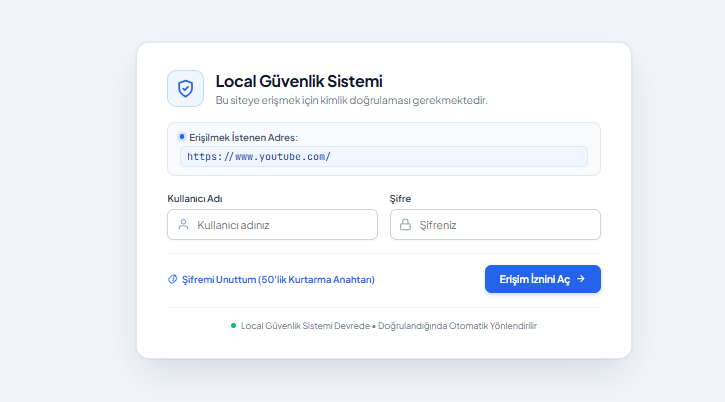
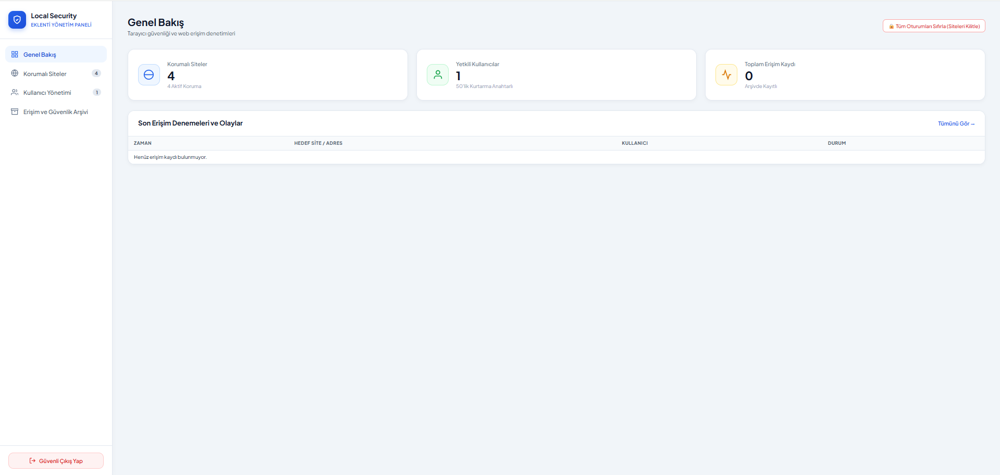
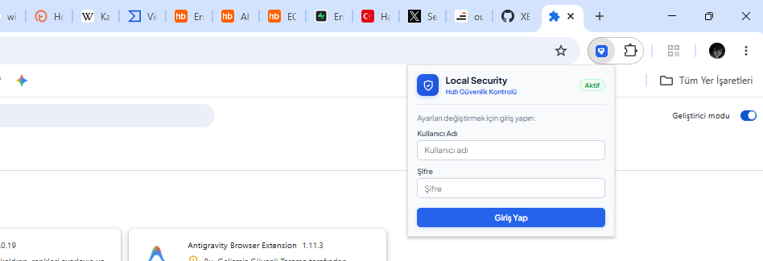

# 🛡️ Local Güvenlik ve Web Kilit Sistemi

Tarayıcınızda dilediğiniz web sitelerine erişimi şifreleyen, erişim geçmişini kaydeden ve kolayca yönetebileceğiniz modern bir güvenlik eklentisi.

---

## 📸 Ekran Görüntüleri

### 1. Kilit Ekranı (Şifre İsteme)
Korumalı bir siteye girilmek istendiğinde kullanıcıyı karşılayan kilit ekranı.

<!-- İpucu: Kilit ekranının ekran görüntüsünü alıp 'images/kilit-ekrani.png' ismiyle kaydedebilirsiniz -->

---

### 2. Web Yönetim Paneli
Tüm engelli siteleri, kullanıcıları ve güvenlik loglarını yönetebileceğiniz ana panel.

<!-- İpucu: Yönetim panelinin ekran görüntüsünü alıp 'images/web-paneli.png' ismiyle kaydedebilirsiniz -->

---

### 3. Hızlı Pop-up Menü
Tek tıkla korumayı aktif/pasif yapabileceğiniz ve panele hızlıca geçebileceğiniz arayüz.

<!-- İpucu: Pop-up menünün ekran görüntüsünü alıp 'images/popup-menu.png' ismiyle kaydedebilirsiniz -->

---

## ✨ Özellikler

- **🔒 Site Kilitleme:** İstediğiniz web sitelerine (YouTube, Instagram vb.) erişimi şifreli hale getirin.
- **🌐 Global Koruma:** İsterseniz tek tıkla tüm internet erişimini şifreye bağlayın.
- **📊 Güvenlik Logları:** Hangi siteye ne zaman girilmeye çalışıldığını ve engellendiğini takip edin.
- **🔑 Kurtarma Anahtarı:** Şifrenizi unutmanız durumunda 50 karakterlik özel kurtarma anahtarı ile erişim sağlayın.
- **⚡ Hafif ve Hızlı:** Hiçbir harici sunucuya ihtiyaç duymadan %100 yerel (local) çalışır.

---

## 🚀 Kurulum

1. Google Chrome veya Microsoft Edge tarayıcınızı açın.
2. Adres çubuğuna `chrome://extensions/` yazın ve **Geliştirici Modu**'nu açın.
3. **Paketlenmemiş öge yükle** butonuna tıklayarak bu proje klasörünü seçin.

---

## 🔐 Varsayılan Giriş Bilgileri

* **Kullanıcı Adı:** `admin`
* **Şifre:** `admin123`
